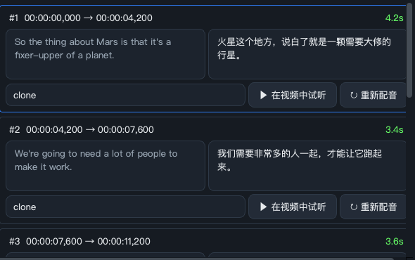
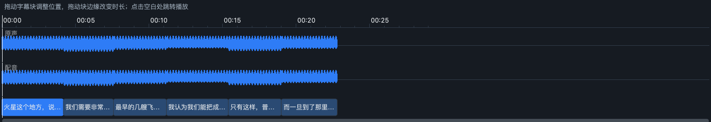
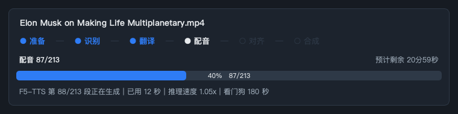
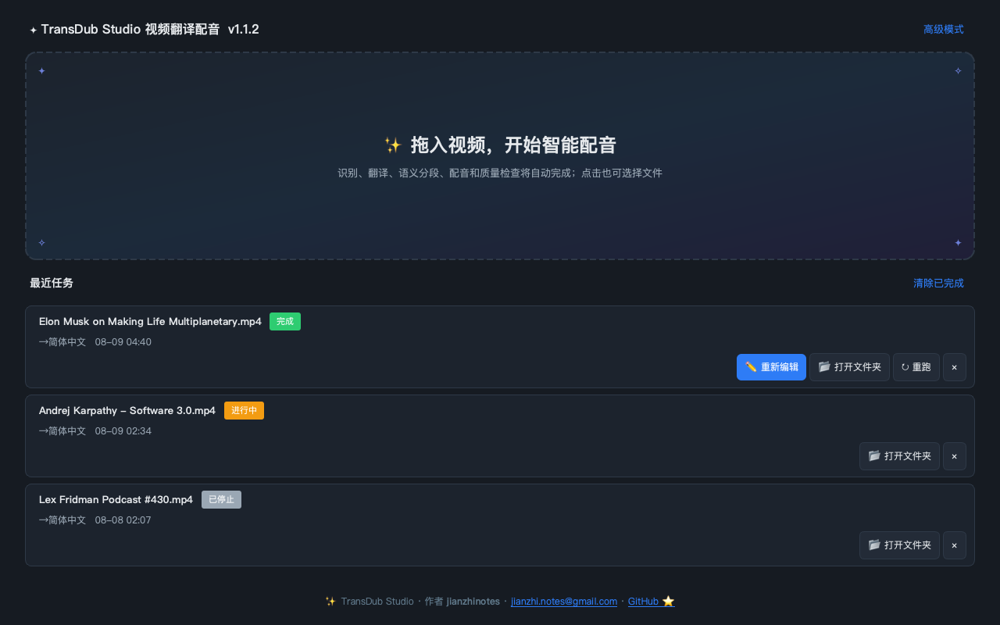

<div align="center">

# ✨ TransDub Studio

### Open-source, local-first Chinese dubbing & bilingual subtitles for long-form video — **every line stays editable.**

A **free, local, open-source** alternative to CapCut dubbing &amp; ElevenLabs Dubbing Studio.

[](https://github.com/jianzhinotes/TransDub-Studio/releases/latest)
[](https://github.com/jianzhinotes/TransDub-Studio/releases)
[](https://github.com/jianzhinotes/TransDub-Studio/stargazers)
[](LICENSE)


**[⬇️ Download for Windows &amp; macOS](https://github.com/jianzhinotes/TransDub-Studio/releases/latest)** · [📖 中文说明](docs/README_CN.md) · [🚀 Why it's different](#why)

<br>

https://github.com/user-attachments/assets/f23aae53-6d21-432a-9ab0-a5589af0a1bd

**[▶ Watch full-screen](https://jianzhinotes.github.io/TransDub-Studio/demo/)** — locally generated Chinese dubbing, stable per-speaker voice identity, Chinese-first prosody and burned bilingual subtitles.

<sub>The Chinese voice in this demo is AI-generated. It is not the speaker's original speech or an endorsement.</sub>

<br>

<sub>Author **jianzhinotes** · <jianzhi.notes@gmail.com> · built on [pyVideoTrans](https://github.com/jianchang512/pyvideotrans) · GPL-3.0</sub>

</div>

## 📸 Inside the app

The video above shows the output. These show the part that actually matters when the output is *almost* right — **every line stays editable**.

**Per-line dubbing review** — source and translation side by side, per-line voice, audition and re-dub. Nothing is a black box you can only re-run.



**Editable timeline** — original and dubbed waveforms on one ruler; drag a subtitle block to move it, drag its edge to change duration.



**Live progress with a real ETA** — segment counter, elapsed time and remaining estimate come from the dubbing pipeline itself, not from guessing.



**Reopenable projects** — every finished job stays on the home page; reopen it to re-edit and re-export without re-running recognition or translation.



## What is TransDub Studio?

**TransDub Studio** is an open-source, local-first studio for Chinese long-form video, built on [pyVideoTrans](https://github.com/jianchang512/pyvideotrans). It offers two clear deliverables: a Chinese-dubbed version, or an original-audio video with English-above-Chinese bilingual subtitles. Instead of treating recognition, translation and TTS as disconnected model calls, it coordinates whole-context translation, semantic segmentation, target duration, synthesis, language checks and local repair as one resumable workflow. ASR, LLM and TTS models remain replaceable backends rather than defining the product.

`recognition → whole-context translation → bilingual subtitles or semantic/timing orchestration → dubbing → quality gates and local repair → rendering`

| Choose this output | What you get |
|---|---|
| **Chinese dubbing + Chinese subtitles** | A local Chinese-dubbed version with per-clip quality checks, repair and reopenable editing. |
| **Original audio + bilingual subtitles** | Original audio stays intact; English appears above Chinese in a Bilibili-oriented hard-subtitle render. It skips TTS, dubbing quality gates and Dubbing Studio. |

<a id="why"></a>

## 🚀 Why TransDub Studio — vs CapCut & ElevenLabs

The polished editing experience of CapCut and ElevenLabs, but **local, private, and free** — your video and voice never have to leave your computer.

| | **TransDub Studio** | CapCut (剪映) | ElevenLabs |
|---|:---:|:---:|:---:|
| **Runs locally / offline** | ✅ full pipeline can run 100% local | ☁️ cloud only | ☁️ cloud only |
| **Cost** | ✅ **free** local stack, or bring-your-own API | membership + dubbing limits | pay-per-character |
| **Length / watermark limits** | none | yes | quota-limited |
| **Data privacy** | ✅ stays on your machine | uploaded to cloud | uploaded to cloud |
| **Voice cloning** | ✅ F5-TTS, local | limited | ✅ cloud |
| **Channel choice** | ✅ 79 recognition/translation/TTS channels, mix & match | fixed | fixed |
| **Per-line dubbing edit** | ✅ | limited | ✅ |
| **Timeline proofreading** | ✅ | ✅ | ✅ |
| **Open source / customizable** | ✅ GPL-3.0 | ❌ | ❌ |

**Key advantages**

- **🧠 One coordinated plan.** Translation, semantic boundaries, target duration, synthesis and quality feedback are optimized together. The default workflow is one click, while every decision remains inspectable in Dubbing Studio.
- **🌐 Two clean delivery paths.** Need a localized video? Create Chinese dubbing. Need the original speaker? Create bilingual subtitles without starting any TTS model. The latter uses a readable English-above-Chinese hard-subtitle preset and keeps the original soundtrack.
- **🎬 Built for long-form Chinese dubbing.** Persistent checkpoints, segment-level retries, preflight validation and cache-safe resume avoid throwing away hours of successful work when a few clips fail.
- **🌡 Resource-aware by default.** Per-clip quality signatures avoid full-track rechecks; disposable MLX/CPU validators release model memory between stages, while Apple Silicon automatically limits quality-neutral FFmpeg, separation and speaker-analysis concurrency.
- **🔒 Local & private.** Recognition (faster-whisper), translation (local LLM / offline models), and voice cloning (F5-TTS) can all run offline. Nothing is uploaded unless *you* pick a cloud API. CapCut and ElevenLabs always send your media to their servers.
- **🧹 Incremental cleanup for legacy projects.** Dubbing Studio can audit every existing Chinese clip with the local strong speech model, keep passed audio untouched, and send only mixed-language, truncated, spilled, or repeated clips to focused repair. Export validates the current text/audio/rules signatures rather than trusting an old manifest file.
- **🌡 Long-video resource control.** Clip-level quality checkpoints avoid rechecking completed work, reference clips are cut in-process instead of spawning FFmpeg hundreds of times, and `.tdproj` stage journals restore honest task status after interruption.
- **🛟 Local failure recovery.** A few bad F5 clips no longer discard a long run: passed audio is preserved, failed clips open as a focused repair queue, and export resumes after only those clips pass strong-model verification. Project diagnostics expose stage time, peak memory, TTS RTF, cache hits, and quality totals.
- **🎙️ YouTube-like Chinese-first performance transfer.** Smart dubbing persists one prosody contract for translation timing, pauses, speech act, and synthesis. Verified bootstrap clips become per-speaker Chinese conditioning anchors. A model-free second layer transfers only speaker-normalized energy/activity statistics with bounded, clipping-safe gain—never English phonemes. Strong-ASR validation checkpoints every completed clip and resumes only unfinished work after a crash. The former per-line source-clone route remains an explicit advanced policy.
- **🎚️ Dialogue-first mastering.** Separated music/effects and optional music beds are sidechain-ducked only while Chinese dialogue is active, mixed without automatic volume division, and peak-guarded around −1 dBFS. Compatible static fallbacks and an `audio_mix_report.json` keep the final render reliable and diagnosable.
- **🇨🇳 Strict Chinese-output validation.** Speakable brand, model, unit, and acronym forms are localized before synthesis; unexpected Latin speech is sent to focused repair. Reference policy and prosody are part of every audio/cache signature, so changing strategy cannot silently reuse an older mixed-language clip.
- **🎙 Per-speaker reference banks.** Up to three ASR-verified anchors are retained per reliable voice cluster, matched by sentence style and rotated on retry. Chinese coverage checks also catch truncation, content mismatch, and spillover from adjacent clips.
- **💰 Free, no limits.** A fully free stack — faster-whisper + Google/local-LLM translation + Edge-TTS — costs nothing, has **no subscription, no watermark, no length or quota caps**. ElevenLabs bills per character/minute; CapCut gates dubbing behind membership and time limits.
- **🎛 Your choice of engines.** 79 channels across recognition / translation / TTS. Free local, DeepSeek, OpenAI, Gemini, DeepL, ElevenLabs, Azure… mix them however you like — not locked to one vendor.
- **✂️ Best of both editors.** CapCut-style step-by-step proofreading (fix the transcript, then the translation, then the dubbing) **and** ElevenLabs-style per-line editing (edit source/translation, swap voices, re-dub, drag the timeline) — in one inline workspace, no popups.
- **♻️ Reopenable projects.** Every finished job is saved as a local project you can reopen anytime to re-edit and re-export — and it only re-runs alignment + merge, not the whole pipeline (no repeated API cost).
- **🖥 Native app experience.** Rebranded macOS `.app`, encrypted local API-key storage, remembered settings, and a classic Advanced Mode for batch processing and every parameter.

## ✨ The new Flow UI (default)

Launch the app and you land in a streamlined one-click flow:

1. **Home** — drag & drop a video (or click to browse), see recent tasks with status chips, one-click reopen of results.
2. **Choose a deliverable** — select **Chinese dubbing + Chinese subtitles** or **original audio + bilingual subtitles**, then choose a target language. The dubbed route runs recognition, translation, semantic re-segmentation, duration planning, dubbing, quality checks, alignment and rendering; the bilingual route keeps original audio and skips TTS entirely. Engine, subtitle and alignment controls are folded into **Advanced settings**.
3. **Progress** — a per-task six-stage stepper (prepare → recognize → translate → dub → align → merge). The default flow does not pause for routine proofreading; saved checkpoints resume recognition, translation and orchestration after interruption. Reopen the finished local project in **Dubbing Studio** only when you want detailed per-line editing and A/B review.

The classic full-featured UI (batch processing, all 79 channels, advanced parameters) is still available via **Tools → Advanced Mode**.

### Run from source

## 📦 Installation

### Easiest — download an installer

Grab the latest installer from the [**Releases**](https://github.com/jianzhinotes/TransDub-Studio/releases) page:

- **Windows:** `TransDub-Studio-Setup-<version>.exe` → double-click, follow the wizard.
- **macOS:** `TransDub-Studio-<version>.dmg` → open, drag to Applications, then allow it once — see below (unsigned build).

<details>
<summary><b>macOS blocks it the first time — how to allow it</b></summary>

The build is unsigned, so macOS shows *"Apple could not verify … is free of malware"*. Allow it once:

**Try this first:** Control-click (right-click) the app → **Open** → **Open**.

**If that doesn't offer an Open button** — macOS 15 Sequoia and later restricted this path:

1. Double-click the app and dismiss the warning.
2. **System Settings → Privacy & Security**, scroll down.
3. Next to *"TransDub Studio was blocked…"* click **Open Anyway**, authenticate, then confirm **Open**.

Either way it is a one-time step. Terminal equivalent, if you prefer:

```bash
xattr -d com.apple.quarantine "/Applications/TransDub Studio.app"
```

</details>

The installer is small; on first launch it downloads the runtime + models (a few GB) and then runs fully local. Builds are **unsigned**, so Windows SmartScreen shows *More info → Run anyway*, and macOS needs the one-time approval above.

> Prefer the command line, or no installer published yet for your version? Use the one-liners below.

`uv` manages the Python 3.10 runtime for you, so there's nothing else to install by hand. First launch downloads the recognition model (faster-whisper) on demand; after that the core pipeline runs fully local. Dependencies + models take a few GB, so give the first setup a good connection and some patience.

### macOS — one command

Open **Terminal** and paste:

```bash
curl -fsSL https://raw.githubusercontent.com/jianzhinotes/TransDub-Studio/main/install.sh | bash
```

Then launch it anytime:

```bash
cd ~/TransDub-Studio && uv run python sp.py
```

### Windows — one command

Install [Git for Windows](https://git-scm.com/download/win) first, then in **PowerShell** paste:

```powershell
powershell -ExecutionPolicy Bypass -Command "irm https://raw.githubusercontent.com/jianzhinotes/TransDub-Studio/main/install.ps1 | iex"
```

Then launch it anytime:

```powershell
cd $HOME\TransDub-Studio; uv run python sp.py
```

> On Windows, dependencies pull the **CUDA (GPU) build** of PyTorch. With an NVIDIA GPU + recent driver you get GPU acceleration automatically; without one it still runs on CPU (just slower). The macOS build uses the CPU/Metal PyTorch wheel.

### Manual (any platform)

```bash
git clone https://github.com/jianzhinotes/TransDub-Studio.git
cd TransDub-Studio
uv sync              # first time only, installs Python 3.10 + deps
uv run python sp.py
```

## 🖥️ System requirements

`uv` installs and pins Python 3.10 for you — nothing else to set up by hand.

| | Minimum | Recommended |
|---|---|---|
| **OS** | macOS 11+ (Apple Silicon or Intel) · Windows 10/11 | macOS 13+ Apple Silicon · Windows 11 |
| **RAM** | 8 GB | 16 GB+ |
| **Disk** | ~8 GB (dependencies + one recognition model) | 15 GB+ if you keep several models |
| **GPU** | none — CPU works | NVIDIA (Windows, CUDA build installed automatically) · Apple Silicon (Metal) |

**Notes**

- **Apple Silicon with 18 GB or less** automatically switches to a low-memory dubbing profile: synthesis runs serially and the recognition and dubbing models are loaded in turn rather than together. Slower, but it will not exhaust unified memory.
- **Recognition on Apple Silicon** can use the Metal GPU via the optional `mlx-whisper` backend (`use_mlx_whisper: true` in `videotrans/cfg.json`). Measured on `large-v3-turbo`: **23.6 s → 9.8 s** for the same clip.
- **Windows** installs the CUDA build of PyTorch. With an NVIDIA GPU and a recent driver you get acceleration automatically; without one it falls back to CPU.
- **Model sizes** for reference: `faster-whisper large-v3-turbo` ≈ 2.8 GB, its MLX variant ≈ 1.5 GB, `tiny` ≈ 75 MB. They download on demand the first time you use them.

## Major improvements over the upstream project

### 0. Flow UI, Dubbing Studio & timeline preview

- New default CapCut/ElevenLabs-style flow: Home → single-page smart config → staged progress.
- ElevenLabs-style **Dubbing Studio** at the post-dubbing pause: speaker cards, editable timeline, per-line re-dub, A/B audio preview. No more countdown auto-skip.
- Read-only **Timeline Preview** tool (video + original/dubbed waveforms + subtitle blocks on one synced timeline) available from the Tools menu for any video + SRT.
- Fixed a long-standing bug where subtitle/text edits in the dubbing review step were silently discarded (queue_tts.json was never written back / reloaded).

### 1. macOS app experience

- Renamed and packaged as **TransDub Studio**.
- Added a custom macOS-style app icon.
- Added a macOS `.app` wrapper with background startup.
- Avoids opening extra black Terminal windows when launching the app.
- Adds single-instance behavior so double-clicking does not start multiple copies.
- Keeps the F5-TTS local service running quietly in the background.
- Uses a local Application Support runtime path to reduce macOS permission problems.

### 2. DeepSeek translation improvements

- Tunes the DeepSeek subtitle translation prompt for full-context subtitle translation.
- Sends SRT content with broader context instead of translating many small isolated chunks.
- Encourages consistent terminology, better sentence continuity, and more natural Chinese output.
- Reduces accidental untranslated English where the target output should be Chinese.
- Includes prompt-aware translation caching so prompt changes do not keep reusing stale translations.

### 3. F5-TTS voice cloning reliability

- Adds safer reference-audio selection to avoid leaking names or English phrases from reference clips into generated Chinese dubbing.
- Adds detection for unexpected English words in generated Chinese audio.
- Adds retry behavior when F5-TTS output appears to contain subtitle-unrelated English.
- Reduces heavy local inference settings for better behavior on Apple Silicon machines.
- Adds memory cleanup around local F5-TTS inference to reduce long-run instability.
- Fails fast when dubbing generation fails, instead of silently producing a broken final video.

### 4. Dubbing and audio output quality

- Improves handling around failed TTS segments.
- Reduces the chance of mixed original English appearing in a final dubbed result.
- Improves voice-cloning workflow stability for local video translation experiments.
- Keeps manual subtitle/proofreading workflow from pyVideoTrans while adding extra checks around generated audio.

### 5. Project identity and licensing cleanup

- Adds a clear downstream identity: **TransDub Studio**.
- Keeps attribution to the original pyVideoTrans author and project.
- Adds [NOTICE](NOTICE) and [MODIFICATIONS.md](MODIFICATIONS.md) to clearly document that this is a modified build.
- Keeps the project under GPL-3.0, consistent with upstream pyVideoTrans.

## Who is this for?

TransDub Studio is mainly for users who want to run an AI video translation and dubbing workflow locally on macOS, especially when using:

- DeepSeek-compatible APIs for subtitle translation.
- Local F5-TTS voice cloning.
- Chinese dubbing output from English source videos.
- A double-clickable macOS app experience instead of command-line-only usage.

## Current status

This repository is a personal downstream build. It is useful as a working customized version, but it is not an official release channel of pyVideoTrans.

Large local models are **not** intended to be committed into this repository. They should be downloaded or deployed separately when needed.

## Source deployment

Requirements:

- Python 3.10
- FFmpeg
- `uv`

Clone:

```bash
git clone https://github.com/jianzhinotes/TransDub-Studio.git
cd TransDub-Studio
```

Install dependencies:

```bash
uv sync
```

Launch:

```bash
uv run sp.py
```

## Supported workflow

TransDub Studio inherits the broad pyVideoTrans feature set, including:

- Speech recognition / subtitle generation.
- Subtitle translation through local or online translation channels.
- AI dubbing and voice cloning.
- Audio/video/subtitle merging.
- Manual proofreading during recognition, translation, and dubbing.
- CLI usage for batch processing.

See upstream pyVideoTrans documentation for the general feature set and configuration details:

- [pyVideoTrans repository](https://github.com/jianchang512/pyvideotrans)
- [pyVideoTrans documentation](https://pyvideotrans.com)

## 🗺️ Roadmap

Directions, not commitments — this is a personal downstream build.

**Being looked at next**

- Verifying the Windows installer on real hardware (it is built in CI but has not been run end-to-end on a physical Windows machine yet)
- A CosyVoice2 A/B against F5-TTS for cross-language voice cloning
- Cancelling a single task instead of the whole queue
- Video thumbnails on the home page

<details>
<summary><b>Shipped so far</b></summary>

- **Workflow** — CapCut-style Flow UI (home → single-page config → staged progress); step-by-step inline proofreading after recognition, translation and dubbing; reopenable projects that re-run only alignment and merge
- **Dubbing Studio** — per-line speaker cards with source and translation side by side, editable timeline with both waveforms, per-line re-dub and voice switching, original/dubbed A/B preview
- **Voice quality** — automatic reference read-back validation, composite references, speaker clustering so an interview clones the main speaker rather than the host, per-speaker voices, Chinese anchors for retries, F5 native 32 diffusion steps with a fixed seed for a stable timbre
- **Reliability** — quality gate with automatic repair and a circuit breaker, per-clip durable checkpoints, cross-run dubbing cache, synthesis watchdog, low-memory profile for Apple Silicon
- **Speed** — optional `mlx-whisper` Metal backend (~2.4× on `large-v3-turbo`), incremental re-runs that reuse recognition and translation
- **Packaging** — signed-free macOS `.dmg` and Windows `.exe` installers built in CI, plus one-command installers for both platforms

</details>

## ❓ FAQ

<details>
<summary><b>Is the voice quality as good as ElevenLabs?</b></summary>

For same-language synthesis it is close. For **cross-language cloning** — an English speaker dubbed into Chinese — ElevenLabs' cloud models are still ahead; that is the hardest case for local models and it is honest to say so.

What you get instead: the result is never a black box. Every line can be auditioned, re-dubbed with a different voice, retimed on the timeline, or edited and re-exported without re-running the whole pipeline. When a clip is *almost* right, that matters more than the first-pass score.
</details>

<details>
<summary><b>Will it run on my Mac?</b></summary>

Yes, including 8 GB machines, though dubbing will be slow. On Apple Silicon with 18 GB or less the app automatically switches to a low-memory profile so it does not exhaust unified memory. 16 GB is comfortable; 24 GB+ runs the normal profile.
</details>

<details>
<summary><b>Do I need a GPU?</b></summary>

No. Everything runs on CPU. A GPU only changes speed: NVIDIA on Windows (the CUDA build installs automatically) or the Metal backend on Apple Silicon for recognition.
</details>

<details>
<summary><b>Does my video get uploaded anywhere?</b></summary>

Not by the app. There is no account, no telemetry and no analytics — the codebase contains no usage-reporting code at all. Media leaves your machine **only** if you deliberately pick a cloud channel (for example DeepSeek for translation or ElevenLabs for dubbing). A fully local stack — faster-whisper + a local LLM + F5-TTS — never makes a network call.
</details>

<details>
<summary><b>Which languages and engines are supported?</b></summary>

35 languages, and 79 interchangeable channels: 22 for recognition, 24 for translation, 33 for dubbing. The Flow UI surfaces a curated subset (3 / 6 / 5) so you are not choosing from 79 things on day one; the rest stay available in Advanced Mode.
</details>

<details>
<summary><b>Can I use it commercially?</b></summary>

The tool is GPL-3.0, so yes — you can use it and the videos you produce commercially. The obligation is on *distributing modified versions of the software*, which must stay GPL-3.0. This is a summary, not legal advice; read [LICENSE](LICENSE) if it matters to you.
</details>

<details>
<summary><b>How long does dubbing take?</b></summary>

It depends heavily on the machine, the engine and the length of the video, so any single number here would be misleading. The app answers this itself: during dubbing the task card shows a live segment count and a remaining-time estimate computed from your actual throughput.

Re-runs are much faster — recognition, translation and previously generated audio are all reused unless you tick **Fresh run**.
</details>

<details>
<summary><b>How do I uninstall it?</b></summary>

Delete the install directory (`~/TransDub-Studio` for the one-command installer, or the app bundle) and `~/Library/Application Support/TransDub Studio` on macOS. Downloaded models live in `models/` inside the install directory and go with it.
</details>

## License and attribution

TransDub Studio is based on [pyVideoTrans](https://github.com/jianchang512/pyvideotrans), created by [jianchang512](https://github.com/jianchang512).

The original project is licensed under **GPL-3.0**. This modified version is also distributed under **GPL-3.0**.

This repository is not affiliated with or endorsed by the official pyVideoTrans project. For details, see:

- [LICENSE](LICENSE)
- [NOTICE](NOTICE)
- [MODIFICATIONS.md](MODIFICATIONS.md)

## Acknowledgements

This project relies on the work of pyVideoTrans and many open-source projects, including:

- [pyVideoTrans](https://github.com/jianchang512/pyvideotrans)
- [FFmpeg](https://github.com/FFmpeg/FFmpeg)
- [PySide6](https://pypi.org/project/PySide6/)
- [faster-whisper](https://github.com/SYSTRAN/faster-whisper)
- [openai-whisper](https://github.com/openai/whisper)
- [edge-tts](https://github.com/rany2/edge-tts)
- [F5-TTS](https://github.com/SWivid/F5-TTS)
- [CosyVoice](https://github.com/FunAudioLLM/CosyVoice)
