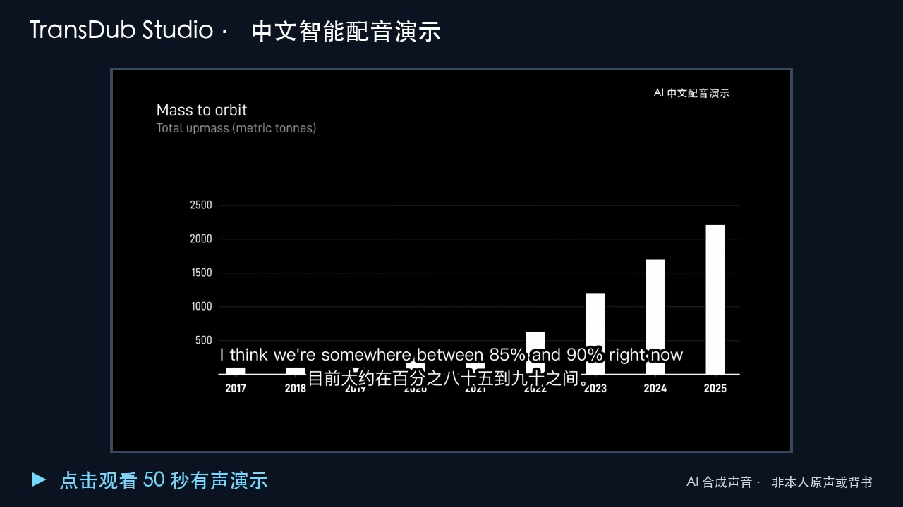

<div align="center">

# ✨ TransDub Studio

### 开源、本地优先的中文视频配音与双语字幕工作台——**模型只是可替换后端。**

**免费、本地、开源**的剪映配音 / ElevenLabs Dubbing Studio 平替。

[](https://github.com/jianzhinotes/TransDub-Studio/releases/latest)
[](https://github.com/jianzhinotes/TransDub-Studio/releases)
[](https://github.com/jianzhinotes/TransDub-Studio/stargazers)
[](../LICENSE)


**[⬇️ 下载 Windows / macOS 安装包](https://github.com/jianzhinotes/TransDub-Studio/releases/latest)** · [📖 English](../README.md) · [🚀 凭什么不一样](#why)

<br>

[](assets/transdub-studio-demo.mp4)

**[▶ 点击观看 50 秒有声演示](assets/transdub-studio-demo.mp4)** —— 本地生成的中文配音，固定说话人音色、中文优先韵律与烧录双语字幕。

<sub>演示中的中文声音由 AI 合成，并非说话人本人原声或背书。</sub>

<br>

<sub>作者 **jianzhinotes** · <jianzhi.notes@gmail.com> · 基于 [pyVideoTrans](https://github.com/jianchang512/pyvideotrans) · GPL-3.0</sub>

</div>

## TransDub Studio 是什么？

**TransDub Studio** 是基于 [pyVideoTrans](https://github.com/jianchang512/pyvideotrans) 构建的开源、本地优先中文长视频工作台。它提供两条明确的成片路径：生成中文配音版，或保留原声并生成中英文双语字幕版。它不再把识别、翻译和 TTS 当成互不相干的模型调用，而是把全文翻译、语义分段、目标时长、配音生成、语言质检和局部返工组织成一条可断点恢复的工作流。ASR、LLM、TTS 都只是可替换后端，不绑定任何单一厂商或模型。

`语音识别 → 全文翻译 → 双语字幕，或语义/时长联合编排 → 配音 → 质量门禁与局部返工 → 合成`

| 选择的成片类型 | 得到什么 |
|---|---|
| **中文配音 + 中文字幕** | 本地生成中文配音，逐段质量核对与返工，工程可随时重开精修。 |
| **保留原声 + 中英文双语字幕** | 原片声音完全保留，英文在上、中文在下烧录到视频；不启动 TTS、不进行配音质检，也不用进入配音工作台。 |

<a id="why"></a>

## 🚀 为什么选 TransDub Studio —— 对比剪映 / ElevenLabs

剪映和 ElevenLabs 那样精致的编辑体验，但**本地、私密、免费**——你的视频和语音不必离开本机。

| | **TransDub Studio** | 剪映 CapCut | ElevenLabs |
|---|:---:|:---:|:---:|
| **本地 / 离线运行** | ✅ 核心链路可 100% 本地 | ☁️ 仅云端 | ☁️ 仅云端 |
| **费用** | ✅ **免费**本地方案，或自带 API | 会员 + 配音时长限制 | 按字符计费 |
| **时长 / 水印限制** | 无 | 有 | 配额限制 |
| **数据隐私** | ✅ 不出本机 | 上传云端 | 上传云端 |
| **音色克隆** | ✅ F5-TTS 本地克隆 | 有限 | ✅ 云端 |
| **渠道自由** | ✅ 79 个识别/翻译/配音渠道自选 | 固定 | 固定 |
| **逐句配音编辑** | ✅ | 有限 | ✅ |
| **时间轴校对** | ✅ | ✅ | ✅ |
| **开源可定制** | ✅ GPL-3.0 | ❌ | ❌ |

**核心优势**

- **🧠 统一编排，不是模型拼盘。** 翻译、语义边界、目标时长、配音和质量反馈在同一份计划中协同决策；默认一键完成，需要时仍可在配音工作台检查每个决定。
- **🌐 两条清晰成片路径。** 要中文配音就走完整本地配音链路；想保留原说话人，就直接生成双语字幕版。后者使用适合 B 站长访谈的英文在上、中文在下硬字幕样式，不会加载任何 TTS 模型。
- **🎬 为中文长视频而生。** 编排断点、逐段重试、生成前预飞和安全缓存恢复，让少数坏片段不再浪费整片几个小时的已完成工作。
- **🌡 默认感知机器资源。** 逐段质量签名避免恢复任务时重新核验整片；MLX/CPU 强模型在一次性进程中运行并及时释放内存。运行中会持续低频记录内存、可用内存和系统负载，并在压力升高时自动收缩参考裁切、人声分离、强质量核验的并发或批次，不换小模型、不放宽门禁。诊断窗口可查看最高压力与最低可用内存。
- **♻️ 真正可恢复。** 智能编排、阶段日志和逐段质量结果统一保存在 `.tdproj`；参考音频优先在进程内直接裁切，避免长视频逐段启动 FFmpeg，异常编码则自动回退兼容路径。应用重启后也能正确显示完成、失败或意外中断。
- **🛟 坏段隔离，不再整轮报废。** 普通内容异常会保留所有已通过片段，并自动打开只包含待处理提示的返工工作台；可以只看、只重配异常片段，只有强模型复核通过后才能继续导出。模型缺失、服务不可用等全局错误仍立即停止。诊断信息同时记录阶段耗时、峰值内存、配音 RTF、缓存命中和质量数量。
- **🧹 旧工程也能增量清理。** Dubbing Studio 提供“强模型复核现有配音”，一次加载本地 large-v3-turbo 后逐段检查旧音频。已通过片段原样保留，中英文夹杂、中文截断、串段或重复片段进入局部返工；重新打开工程时会核对当前译文、音频和规则签名，旧版宽松结果不能直接导出。
- **🔌 F5 冷启动可恢复。** 本地服务使用独立的 Hugging Face 缓存环境，不会被主程序的 Whisper/ASR 模型路径覆盖；离线启动仍能找到随服务缓存的 Vocos 与 F5 权重。若依赖、端口或内存确有问题，任务诊断会记录具体原因。
- **🎙️ 类 YouTube 的中文优先表达迁移。** 智能配音把翻译时长、停顿、问句/强调和合成策略保存为同一份韵律计划；少量预飞片段通过核验后建立每位说话人的中文音色锚点。第二层只从原声提取说话人内归一化的能量、活跃度和动态范围，用来挑选更匹配的中文锚点并施加不超过 ±2 dB、带削波保护的表达增益，不传递英文音素。英文原声默认不再逐句持续驱动中文生成；旧的逐句英文克隆保留为高级可选策略。
- **🧾 强质量核验也能断点续跑。** large-v3-turbo 每核验完一段就原子保存转写结果；进程意外退出、系统重启或模型服务崩溃后，只继续尚未完成的片段。断点同时绑定音频内容、目标文本、核验后端、模型和规则版本，任一变化都会自动重新核验。
- **🎚️ 对白优先的智能混音。** 分离出的原片音乐/环境声和手动背景音乐不再直接裸叠加：中文对白出现时自动侧链压低背景，保留无对白处的音乐与环境细节；关闭 FFmpeg 自动音量均分并增加约 −1 dBFS 峰值保护。旧 FFmpeg 不支持侧链时自动退到静态限幅混音，具体策略保存在 `audio_mix_report.json`，不会因一个滤镜不可用丢掉整条成片。
- **🇨🇳 中文成品零容忍意外拉丁词。** SpaceX、AI、GPU、V3 等品牌、缩写和型号在合成前转换为自然中文口播形式；意外拉丁语音进入局部返工。参考策略和韵律计划同时写入音频与缓存签名，切换策略不会误用旧的中英混杂片段。
- **🎙 同说话人参考候选库。** 每个可靠声纹簇最多保留 3 个通过回读的参考，问句、感叹句和陈述句优先匹配相近语气，重试时自动轮换锚点。门禁同时检查中文长度和内容相似度，可发现截断、错句以及相邻片段串入，不再只检查“是不是中文”。
- **🔒 本地私密。** 识别（faster-whisper）、翻译（本地 LLM / 离线模型）、音色克隆（F5-TTS）全都能离线跑，除非**你自己**选云端 API，否则什么都不上传。剪映和 ElevenLabs 始终把你的素材传到它们服务器。
- **💰 免费、无限制。** 全免费方案——faster-whisper + Google/本地LLM 翻译 + Edge-TTS——零成本，**无订阅、无水印、无时长/配额限制**。ElevenLabs 按字符/分钟计费；剪映配音要会员且有时长限制。
- **🎛 引擎任你选。** 识别/翻译/配音共 79 个渠道：免费本地、DeepSeek、OpenAI、Gemini、DeepL、ElevenLabs、Azure…… 随意组合，不被单一厂商绑定。
- **✂️ 两家之长合一。** 剪映式分步校对（先校原文，再校译文，再校配音）**加上** ElevenLabs 式逐句编辑（改原文/译文、换音色、重配、拖时间轴）——都在一个内嵌工作区里，不弹窗。
- **♻️ 工程可反复重开。** 每个完成的任务都存成本地工程，随时重开再编辑再导出，且**只重跑对齐+合成**、不重跑整条流水线（不重复消耗 API 费用）。
- **🖥 原生应用体验。** 重新打包的 macOS `.app`、API 密钥本地加密存储、设置自动记忆，另有经典「高级模式」支持批量处理与全部参数。

## ✨ 全新 Flow 界面（默认）

启动即进入一键流程：

1. **首页** —— 拖入视频（或点击选择），最近任务带状态徽标，一键打开历史结果。
2. **选择成片类型** —— 选择「中文配音 + 中文字幕」或「保留原声 + 中英文双语字幕」，再选择目标语言。配音版会按依赖完成识别、翻译、语义重分段、目标时长编排、配音、质量检查、对齐和合成；双语字幕版保留原声并完全跳过 TTS。模型、字幕和对齐参数统一收进「高级设置」。
3. **进度页** —— 每个任务一张六阶段步进卡（准备→识别→翻译→配音→对齐→合成）。默认不再为常规人工校对反复暂停；中断后复用识别、翻译和智能编排断点。需要逐句精修或 A/B 对比时，再从已保存工程打开 **配音工作台（Dubbing Studio）**。

经典完整界面（批量处理、全部渠道、高级参数）仍在 **工具 → 高级模式** 中。

## 📦 安装

### 最简单 —— 下载安装器

到 [**Releases**](https://github.com/jianzhinotes/TransDub-Studio/releases) 页面下载对应安装器:

- **Windows:** `TransDub-Studio-Setup-<版本>.exe` → 双击,按向导走。
- **macOS:** `TransDub-Studio-<版本>.dmg` → 打开,拖进 Applications,首次**右键 → 打开**(未签名版)。

安装器很小;首次启动时下载运行环境 + 模型(几个 GB),之后完全本地运行。构建**未签名**,所以 Windows SmartScreen 会提示"更多信息 → 仍要运行",macOS 首次需要右键打开。

> 更喜欢命令行,或你的版本还没发布安装器?用下面的一行命令。

`uv` 会自动管理 Python 3.10 运行环境,无需手动装别的。首次启动会按需下载本地识别模型(faster-whisper),之后核心流程完全本地运行。依赖和模型合计几个 GB,首次安装请给好点的网络和一点耐心。

### macOS — 一键安装

打开**终端**，粘贴这一行：

```bash
curl -fsSL https://raw.githubusercontent.com/jianzhinotes/TransDub-Studio/main/install.sh | bash
```

之后每次启动：

```bash
cd ~/TransDub-Studio && uv run python sp.py
```

### Windows — 一键安装

先装 [Git for Windows](https://git-scm.com/download/win)，然后在 **PowerShell** 里粘贴：

```powershell
powershell -ExecutionPolicy Bypass -Command "irm https://raw.githubusercontent.com/jianzhinotes/TransDub-Studio/main/install.ps1 | iex"
```

之后每次启动：

```powershell
cd $HOME\TransDub-Studio; uv run python sp.py
```

> Windows 上依赖会自动装 **CUDA（GPU）版 PyTorch**：有 NVIDIA 显卡 + 较新驱动就自动 GPU 加速，没有则回退 CPU（慢一些但能跑）。macOS 用的是 CPU/Metal 版。

### 手动安装（任意平台）

```bash
git clone https://github.com/jianzhinotes/TransDub-Studio.git
cd TransDub-Studio
uv sync              # 首次，自动装 Python 3.10 + 依赖
uv run python sp.py
```

**环境要求：** macOS（Apple 芯片或 Intel）或 Windows 10/11，预留 5–8 GB 给依赖和模型。

在此基础上，TransDub Studio 针对本地部署、DeepSeek 翻译质量、F5-TTS 原声克隆稳定性、macOS 应用体验和最终配音可靠性做了改进。

本仓库 **不是 pyVideoTrans 官方项目**，而是修改版，并继续遵循 **GPL-3.0** 协议发布。

## 相比原版 pyVideoTrans 的主要改进

### 1. macOS 应用体验优化

- 应用名称改为 **TransDub Studio**。
- 增加更符合 macOS 风格的应用图标。
- 增加 macOS `.app` 启动壳。
- 双击启动时不再弹出多个黑色终端窗口。
- 增加单实例启动逻辑，避免重复打开多个程序。
- F5-TTS 本地服务改为后台静默启动。
- 使用 `Application Support` 中的运行目录，减少 macOS 权限问题。

### 2. DeepSeek 翻译质量改进

- 调整 DeepSeek 字幕翻译提示词，让翻译更重视整段上下文。
- 减少把字幕切成很多小段后逐段翻译导致的上下文丢失。
- 强化术语一致性、句意连贯性和中文表达自然度。
- 减少目标中文字幕中不必要残留英文。
- 翻译缓存加入提示词影响，避免修改提示词后继续复用旧翻译缓存。

### 3. F5-TTS 原声克隆稳定性改进

- 改进参考音频选择逻辑，避免把参考音频里的英文人名或短句泄漏进中文配音。
- 增加生成音频中的异常英文检测。
- 发现生成结果夹杂与字幕无关的英文时自动重试。
- 降低部分本地推理参数，减少 Apple Silicon 机器长时间运行时的压力。
- 增加本地 F5-TTS 推理后的内存清理，降低长任务不稳定概率。
- 如果配音片段生成失败，会中断任务，而不是继续产出有问题的成品。

### 4. 配音与成品可靠性改进

- 改进 TTS 片段失败时的处理。
- 降低最终视频里混入原英文或异常英文的概率。
- 提升本地声音克隆视频翻译流程的稳定性。
- 保留原版可人工校对识别、翻译、配音结果的工作流，同时增加生成音频检查。

### 5. 项目身份与版权声明整理

- 使用新的下游项目名称：**TransDub Studio**。
- 保留对原项目 pyVideoTrans 和原作者的明确署名。
- 新增 [NOTICE](../NOTICE) 和 [MODIFICATIONS.md](../MODIFICATIONS.md)，说明本仓库是修改版，以及主要修改内容。
- 继续使用 GPL-3.0 协议，与原项目保持一致。

## 适合谁使用？

TransDub Studio 主要适合希望在 macOS 本地运行 AI 视频翻译和配音流程的用户，尤其是：

- 使用 DeepSeek 或 OpenAI-compatible API 做字幕翻译。
- 使用本地 F5-TTS 做声音克隆。
- 把英文视频翻译并配成中文。
- 想要双击启动的 macOS 应用体验，而不是纯命令行运行。

## 当前状态

这是一个个人下游定制版本，不是 pyVideoTrans 官方发行渠道。

大型本地模型不建议提交到仓库中，应在本地按需下载或单独部署。

## 源码部署

需要：

- Python 3.10
- FFmpeg
- `uv`

克隆仓库：

```bash
git clone https://github.com/jianzhinotes/TransDub-Studio.git
cd TransDub-Studio
```

安装依赖：

```bash
uv sync
```

启动：

```bash
uv run sp.py
```

## 支持的工作流

TransDub Studio 继承 pyVideoTrans 的主要能力，包括：

- 语音识别 / 字幕生成。
- 使用本地或在线渠道进行字幕翻译。
- AI 配音和声音克隆。
- 音频、视频、字幕合并。
- 识别、翻译、配音阶段的人工校对。
- CLI 批处理。

原版 pyVideoTrans 的通用功能与配置文档可参考：

- [pyVideoTrans 仓库](https://github.com/jianchang512/pyvideotrans)
- [pyVideoTrans 文档](https://pyvideotrans.com)

## 许可证与署名

TransDub Studio 基于 [pyVideoTrans](https://github.com/jianchang512/pyvideotrans) 修改，原项目由 [jianchang512](https://github.com/jianchang512) 创建。

原项目使用 **GPL-3.0** 协议，本修改版也继续使用 **GPL-3.0** 协议发布。

本仓库与 pyVideoTrans 官方项目无从属或背书关系。详情见：

- [LICENSE](../LICENSE)
- [NOTICE](../NOTICE)
- [MODIFICATIONS.md](../MODIFICATIONS.md)

## 致谢

本项目依赖 pyVideoTrans 以及多个开源项目，包括：

- [pyVideoTrans](https://github.com/jianchang512/pyvideotrans)
- [FFmpeg](https://github.com/FFmpeg/FFmpeg)
- [PySide6](https://pypi.org/project/PySide6/)
- [faster-whisper](https://github.com/SYSTRAN/faster-whisper)
- [openai-whisper](https://github.com/openai/whisper)
- [edge-tts](https://github.com/rany2/edge-tts)
- [F5-TTS](https://github.com/SWivid/F5-TTS)
- [CosyVoice](https://github.com/FunAudioLLM/CosyVoice)
